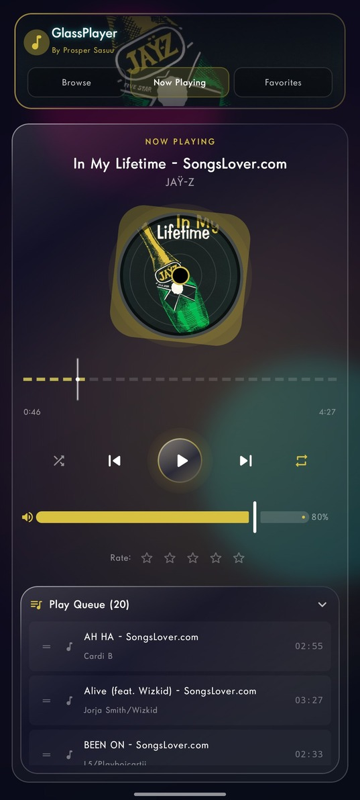
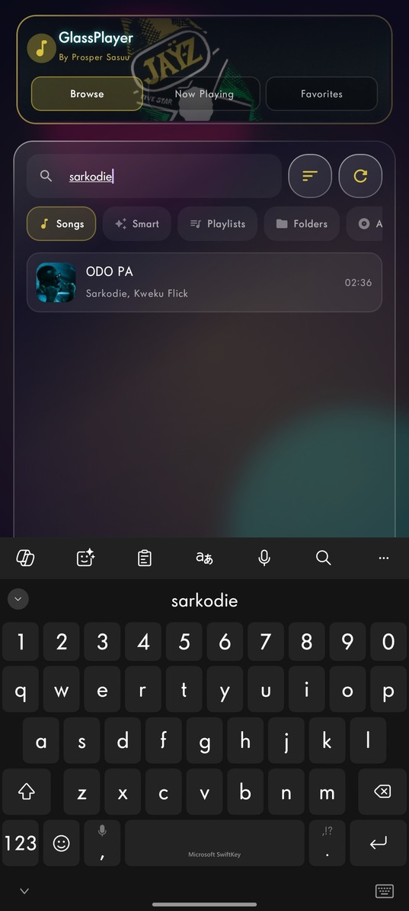

# GlassPlayer By Prosper Sasuu

Glassmorphic local music player for Android (Jetpack Compose).

## Features

### Library & browsing
- Browse **Songs**, **Smart**, **Playlists**, **Folders**, **Albums**, **Artists**, and **Blacklist**
- Search across **titles, artists, albums, and folders**
- **Smart playlists**: Recently Added and Most Played
- Import audio files and scan the device MediaStore library
- **Folder blacklisting** — hide folders (ringtones, voice notes, etc.) via the eye icon or the Blacklist tab
- **Edit tags** — correct Title, Artist, and Album from the song menu (updates Room + MediaStore when allowed)

### Playback engine
- **Media3 ExoPlayer** for local audio (gapless-ready buffering, robust seeking)
- Built-in procedural synth track (**Neon Pulse**) with filter/tempo controls
- Background playback with **MediaSession** notification / lock-screen controls
- Shuffle with history, queue loop, volume, equalizer, sleep timer
- **Playback speed** 0.5x–2.0x (Extras panel) for music and synth
- Android Auto browse support (All Songs, Favorites, Recently Played, Playlists)

### Last.fm setup
- Add credentials as Gradle properties or environment variables:
	- `LASTFM_API_KEY`
	- `LASTFM_API_SECRET`
- Recommended (local only): put them in your user Gradle file (`~/.gradle/gradle.properties`) or OS environment.
- Project build reads these values into `BuildConfig` automatically.

### UI / UX
- Vibrant glassmorphism with **dynamic accent colors** from album art (Palette API)
- Rotating vinyl artwork — **swipe left/right** to skip tracks
- Reactive FFT spectrum + mini beat visualizer on playing rows
- Editable lyrics, share playlists as plain text
- Phone + tablet split layouts

## Run locally

**Prerequisites:** [Android Studio](https://developer.android.com/studio)

1. Open Android Studio and open this project directory
2. Let Gradle sync finish
3. Run on an emulator or device (API 24+)
4. Grant **music / audio**, **notifications** (required on Android 10+ for lock-screen controls), and (for the visualizer) **microphone** when prompted

## Architecture

| Component | Role |
|-----------|------|
| `AudioViewModel` | Library scan, playlists, blacklist, tag edits, engine façade |
| `PlayerEngine` | Media3 ExoPlayer / ProceduralSynth, MediaSession, EQ, visualizer, speed |
| `PlaybackService` | Foreground service + media notification |
| `BlacklistStore` | DataStore persistence for hidden folders |
| `GlassPalette` | Album-art → glass accent colors via Palette API |
| Room (`AudioDatabase`) | Tracks, playlists, play counts, `dateAdded` |

## Screenshots

### Home Screen

### Now Playing

### Playlist

### Search

### Block Folder

## Version notes

This release upgrades the original GlassPlayer with Media3 ExoPlayer, smart playlists, expanded search, dynamic theming, vinyl gestures, folder blacklisting, metadata editing, and refined visualizers — while preserving prior queue, EQ, lyrics, synth, and browse features.
