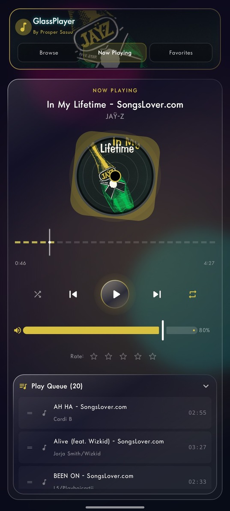
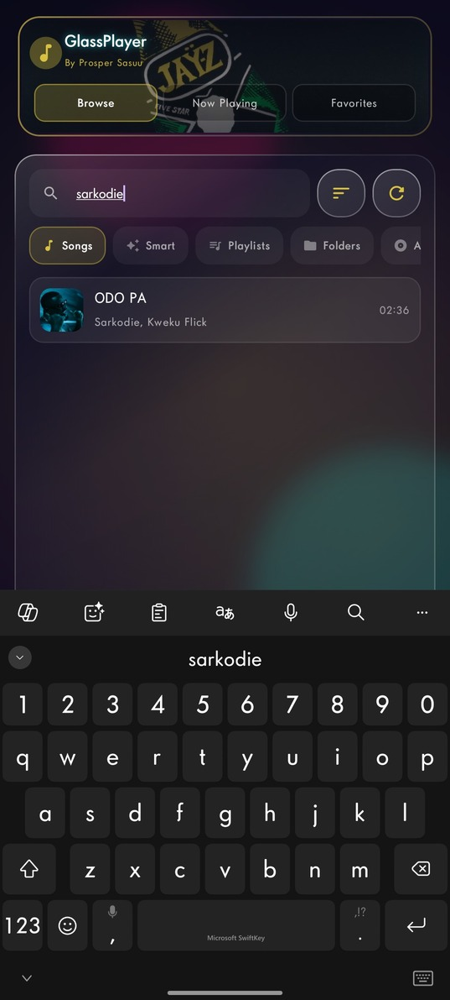

# 🎵 GlassPlayer v2.0

### A modern, glassmorphism-inspired Android music player built with Jetpack Compose.

GlassPlayer is a feature-rich, high-performance Android music player designed to provide a clean, modern, and audiophile-grade listening experience for both local media files and online streaming.

---

## ✨ Key Features

- **🎧 HD Sound Quality Engine**: 32-bit Floating Point PCM audio output built on **Android Media3 ExoPlayer**. Preserves high dynamic range, eliminates quantization noise, and supports high-resolution lossless audio formats (FLAC, ALAC, WAV, AAC, Opus, OGG).
- **⚡ Ultra-Fast Playback & Caching**: Optimized low-latency playback initialization with built-in **100MB LRU Disk Media Cache** (`SimpleCache` + `CacheDataSource`). Streamed tracks load instantly from disk on replay or seek with zero network delay.
- **🌐 YouTube & YouTube Music Integration**: Seamless in-app streaming, high-bitrate audio stream selection (Opus 160kbps+, AAC 256kbps+), YouTube playlist importing, and continuation pagination.
- **🔄 Seamless Mixed Queue Transition**: Intelligent auto-advance that smoothly transitions between online streams and local device tracks without pausing.
- **🎨 Glassmorphic Interface**: Translucent glass cards, frosted blur reflections, and dynamic color palettes adapting to album artwork.
- **📁 Local Music Library & Folders**: Automatic scanning of local device storage with folder blacklist management and metadata extraction.
- **📂 Smart Playlists**: Browse by Songs, Albums, Artists, Playlists, and Folders, plus Smart Playlists (*Recently Added*, *Most Played*, *Never Played*, *Long Tracks*, *Released This Year*).
- **📝 Synced Lyrics**: Real-time LRC lyrics synchronization powered by `LrcLibService`.
- **🎚️ Equalizer & ReplayGain**: Built-in multi-band equalizer, per-track ReplayGain offset normalization, and gradual fade-out sleep timer.
- **🚗 Driving Mode & Android Auto**: Simplified large touch-target driving UI and Android Auto car head unit support.
- **📱 Widgets & Last.fm**: Home screen app widgets and Last.fm scrobbling integration.

---

## 📱 Screenshots

### Home Screen & Now Playing
| Home Screen | Now Playing |
| :---: | :---: |
|  |  |

### Playlists, Search & Folders
| Playlist | Search | Folder |
| :---: | :---: | :---: |
|  |  |  |

### YouTube Music Integration
| YouTube Music | Search & Streaming | Playlist Link Detected | Now Playing (Online) |
| :---: | :---: | :---: | :---: |
|  |  |  |  |

---

## 🛠️ Built With

- **Kotlin** & **Jetpack Compose (Material 3)**
- **Android Media3 & ExoPlayer 1.5.1**
- **Room Database & DataStore Preferences**
- **Coil Image Loading**
- **Gradle & AGP 9**

---

## 📋 Requirements

- Android device or emulator running **Android 8.0+ (API level 26+)**
- Android Studio Ladybug or newer
- JDK 17 / 21 compatible with Gradle setup

---

## 🚀 Build From Source

Clone the repository:

```bash
git clone https://github.com/Ccroxx1/Glassplayer-By-Prosper-Sasuu.git
cd Glassplayer-By-Prosper-Sasuu
```

Open the project in Android Studio and run on an Android device or emulator:

```bash
./gradlew assembleDebug
```
